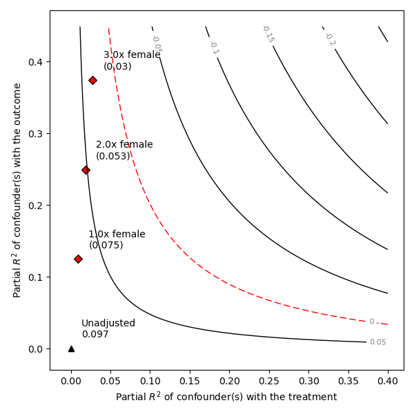

# Sensemakr

[](https://d2cml-ai.github.io/Sensemakr.jl/stable/)
[](https://d2cml-ai.github.io/Sensemakr.jl/dev/)
[](https://github.com/d2cml-ai/Sensemakr.jl/actions/workflows/CI.yml?query=branch%3Amaster)
[](https://codecov.io/gh/d2cml-ai/Sensemakr.jl)

## Installation

You will need Julia version 1.7.0 or higher to install this package.

The latest version can be downloaded by running:

```julia
import Pkg; Pkg.add(url = "https://github.com/d2cml-ai/Sensemakr.jl)
```

The latest stable version can be downloaded by running:

```julia
import Pkg; Pkg.add(Sensemakr)
```

## Example Usage

```julia
using Sensemakr
using CSV, DataFrames, GLM
```

```julia
url = "https://github.com/nlapier2/PySensemakr/raw/main/data/darfur.csv";
darfur = DataFrame(CSV.File(download(url)));
form = @formula(peacefactor ~ directlyharmed + age + farmer_dar + herder_dar + pastvoted + hhsize_darfur + female + village);
fitted_model = lm(form, darfur);
```

```julia
darfur_sense = Sensemakr(fitted_model, "directlyharmed", benchmark_covariates = "female", kd = [1, 2, 3]);
summary(darfur_sense)
```

```
Sensitivity Analysis to Unobserved Confounding

Model Formula: directlyharmed ~ pastvoted + herder_dar + female + peacefactor + farmer_dar + age + hhsize_darfur + village

Null hypothesis: q = 1.0 and reduce = true
-- This means we are considering biases that reduce the absolute value of the current estimate
-- The null hypothesis deemed problematic is H0:tau = 0.0

Unadjusted Estimates of "directlyharmed":
   Coef. Estimate: 0.097
   Standard Error: 0.023
   t-value: 4.184
Sensitivity Statistics:
   Partial R2 of treatment with outcome: 0.022
   Robustness Value, q = 1.0: 0.139
   Robustness Value, q = 1.0 alpha = 0.05: 0.076

Verbal interpretation of sensitivity statistics:

-- Partial R2 of the treatment with the outcome: an extreme confounder (orthogonal to the covariates) that explains 100% of the residual variance of the outcome, would need to explain at least 2.187 % of the residual variance of the treatment to fully account for the observed estimated effect.

-- Robustness Value, q = 1.0: unobserved confounders (orthogonal to the covariates) that of both the treatment and the outcome are strong enough to bring the point estimate to 0.0 (a bias of 100.0% of the original estimate). 
Conversely, unobserved confounders that do not explain more than 13.878% of the residual variance of both the treatment and the outcome are not strong enough to bring the point estimate to 0.0.

-- Robustness Value,q = 1.0, alpha = 0.05: unobserved confounders (orthogonal to the covariates) that explain more than 7.626% of the residual variance of both the treatment and the outcome are strong enough to bring the estimate to a range where it is no longer 'statistically different' from 0.0 (a bias of 100.0% of the original estimate), at the significance level of alpha = 0.05. Conversely, unobserved confounders that do not explain more than7.626% of the residual varianceof both the treatment and the outcome are not strong enough to bring the estimate to a range where it is no longer 'statistically different' from 0.0, at the significance level of alpha = 0.05. 

Bounds on omitted variable bias:
--The table below shows the maximum strength of unobserved confounders with association with the treatment and the outcome bounded by a multiple of the observed explanatory power of the chosen benchmark covariate(s).

3×9 DataFrame
 Row │ bound_label  r2dz_x      r2yz_dx   treatment       adjusted_estimate  adjusted_se  adjusted_t  adjusted_lower_CI  adjusted_upper_CI 
     │ String       Float64     Float64   String          Float64            Float64      Float64     Float64            Float64
─────┼─────────────────────────────────────────────────────────────────────────────────────────────────────────────────────────────────────
   1 │ 1.0x female  0.00916429  0.124641  directlyharmed          0.0752203    0.0218733     3.4389          0.032283            0.118158
   2 │ 2.0x female  0.0183286   0.249324  directlyharmed          0.0529152    0.0203501     2.60025         0.012968            0.0928623
   3 │ 3.0x female  0.0274929   0.37405   directlyharmed          0.030396     0.0186701     1.62806        -0.00625328          0.0670453

```

```julia
plot(darfur_sense)
```

